# Nome do Projeto;

# 🎮 Onde Estão os Netos?

> Um jogo de ação, estratégia e defesa com foco em acessibilidade para o público idoso.

---

## 📖 Sobre o Jogo

**Onde Estão os Netos?** é um jogo em terceira pessoa com visão isométrica que mistura **Tower Defense + Ação**.

A história começa quando uma família é sugada para dentro de um antigo jogo de tabuleiro.  
Os avós, Afonso e Berta, precisam atravessar mundos perigosos para resgatar seus netos e voltar para casa.

---

## 🧠 Conceito Principal

O jogo gira em torno de dois momentos:

- 🌅 **Fase de Preparação (Dia)**
  - Construção de torres
  - Gerenciamento de recursos
  - Expansão da base

- 🌙 **Fase de Confronto (Noite)**
  - Defesa contra hordas de inimigos
  - Combate automático com posicionamento estratégico
  - Suporte direto do jogador

---

## ⚙️ Mecânicas do Jogo

### 🏗️ Construção e Economia
- Construção de torres, casas e quartéis
- Gerenciamento de dinheiro
- Espaços limitados para construção

### ⚔️ Combate
- Ataque automático baseado em proximidade
- Foco em posicionamento estratégico
- Torres atacam automaticamente

### 🎴 Sistema de Cartas (Roguelike)
- Escolha de cartas ao final das fases
- Buffs variados (ataque, economia, torres)
- Sistema de reroll com custo

---

## 👴 Personagens

- **Afonso (Vô)** → Direto e protetor  
- **Berta (Vó)** → Estratégica e analítica  
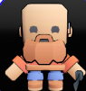

Ambos possuem a mesma jogabilidade, mudando apenas estética e narrativa.

---

## 🌍 Mundos do Jogo

1. 🌲 Floresta Medieval  
2. 🏜️ Deserto Egípcio  
3. 🏚️ Mansão Assombrada  
4. 🌊 Oceano  
5. 🚀 Espaço  
6. 🌋 Covil Final  

Cada mundo possui:
- Inimigos únicos  
- Temática própria  
- Desafios diferentes  

---

## 🎯 Público-Alvo

O jogo foi desenvolvido para o público **idoso**, com foco em:

- Interface acessível  
- Fontes grandes  
- Jogabilidade simples  
- Experiência relaxante  

---

## 🎨 Direção de Arte

- Estilo **3D Low Poly**
- Visual inspirado em **massinha de modelar**
- Cores suaves e agradáveis
- Interface limpa e legível

---

## 🔊 Áudio

- Trilha sonora estilo:
  - 🎵 Lo-fi
  - 🎵 Bossa Nova

- Sons pensados para:
  - Feedback claro
  - Sensação de satisfação
  - Baixo estresse

---

## 🖥️ Plataforma e Tecnologia

- 🛠️ Engine: **Godot**
- 💻 Plataforma: **PC (Windows)**
- 📱 Plataforma: **Android**

---

## 💰 Monetização

- Jogo gratuito
- Anúncios entre fases(se não fose um projeto integrador)
- Opção de remover anúncios com pagamento único(se não fose um projeto integrador)

---

## 📌 Status do Projeto

🚧 Em desenvolvimento

---

## 👥 Equipe

Projeto desenvolvido por estudantes;

ANA LUIZA ESCHER (DESIGN)

Henrique Luan Fritz (CIÊNCIA DA COMPUTAÇÃO)

Luan Vitor Casalli Dalabrda (CIÊNCIA DA COMPUTAÇÃO)

Lucas Panembeker Sckenal (CIÊNCIA DA COMPUTAÇÃO)

---

## 📷 Referências Visuais

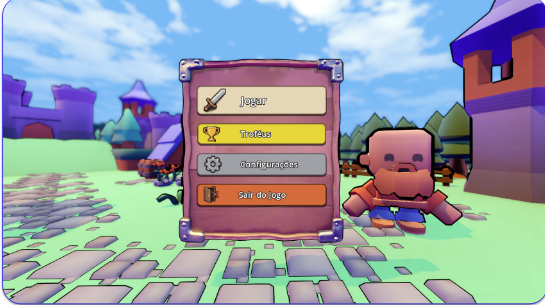
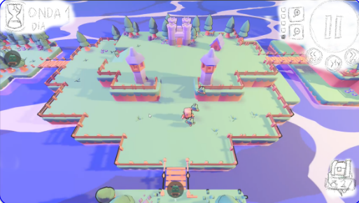
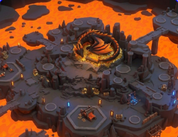
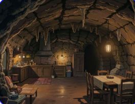
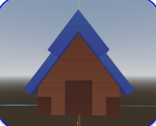
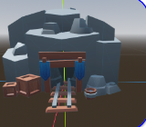
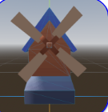
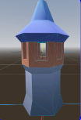
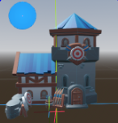
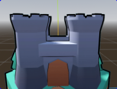

---

## 📜 Licença

A definir.
